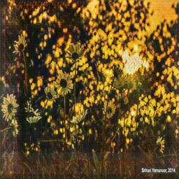

# Generative Adversarial Network
Having fun with some GANs (:

Also, practicing some TensorFlow - much more used to using PyTorch for my daily deep learning programming, so want to get refreshed with a different framework.

## Set up

Download the kaggle dataset using 

```bash
kaggle competitions download -c gan-getting-started
```

## Attempt 1

Simply run main.py - this is based on a popular kaggle notebook from this link: https://www.kaggle.com/amyjang/monet-cyclegan-tutorial

```bash
python3 main.py
```

This notebook uses the CycleGAN - read more here: https://arxiv.org/pdf/1703.10593.pdf

The images produced are pretty cool! (They are taken from real natural images and made to look like Monet paintings)

For e.g.





## Stay Tuned for more improvements later on!
